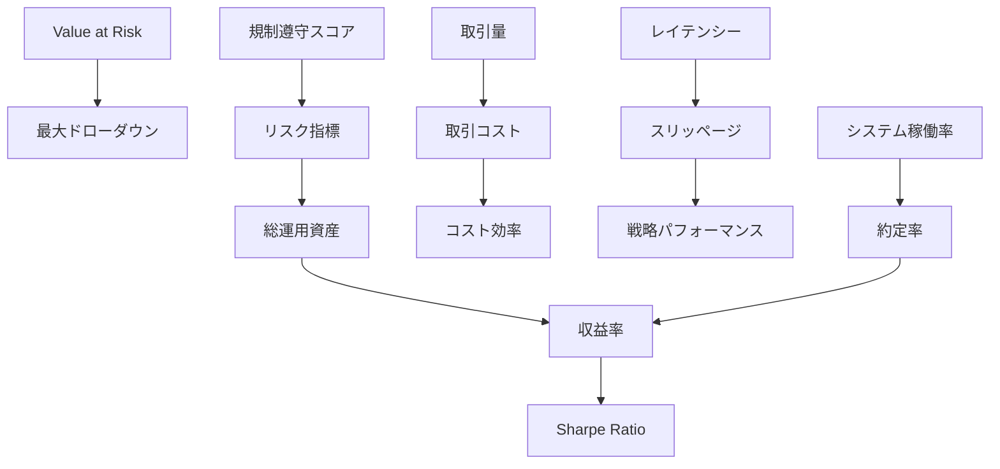
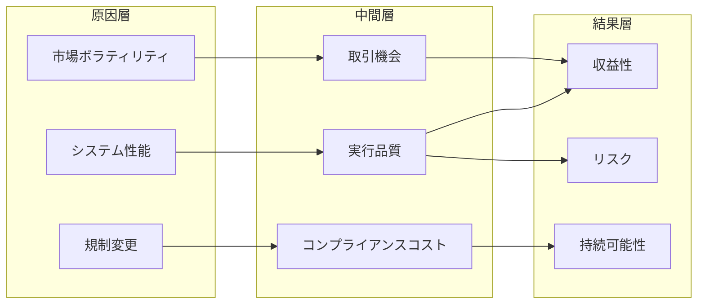
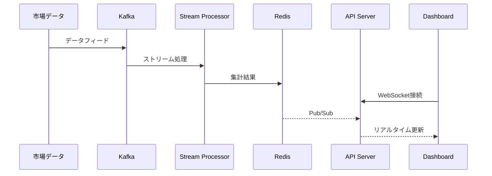

# 仮想通貨リスク駆動システムトレード KPIダッシュボード設計書

## 1. ダッシュボード階層設計

### 1.1 ダッシュボード体系

```
┌─────────────────────────────────────────────┐
│     エグゼクティブダッシュボード (C-Level)    │
├─────────────────────────────────────────────┤
│         運用ダッシュボード (Manager)         │
├─────────────────────────────────────────────┤
│        技術ダッシュボード (Engineer)         │
├─────────────────────────────────────────────┤
│    コンプライアンスダッシュボード (Audit)    │
└─────────────────────────────────────────────┘
```

### 1.2 各階層の役割と目的

#### エグゼクティブダッシュボード

- **対象者**: 経営層、取締役
- **目的**: 戦略的意思決定、全体パフォーマンス把握
- **特徴**: 高度に集約されたKPI、トレンド重視

#### 運用ダッシュボード

- **対象者**: 運用管理者、トレーダー
- **目的**: 日常運用管理、問題の早期発見
- **特徴**: リアルタイム性、詳細な運用指標

#### 技術ダッシュボード

- **対象者**: エンジニア、DevOpsチーム
- **目的**: システム健全性監視、パフォーマンス最適化
- **特徴**: 技術的メトリクス、詳細なログ情報

#### コンプライアンスダッシュボード

- **対象者**: コンプライアンス担当、監査人
- **目的**: 規制遵守確認、リスク管理
- **特徴**: 規制関連指標、監査証跡

## 2. 各ダッシュボードの詳細設計

### 2.1 エグゼクティブダッシュボード

#### 表示KPI（15個）

1. **総運用資産（AUM）**
   - ビジュアライゼーション: 数値カード + トレンドチャート
   - 更新頻度: 1時間毎
   - データソース: ポートフォリオ管理システム
   - アラート条件: 前日比±10%以上の変動

2. **月次収益率**
   - ビジュアライゼーション: ラインチャート + ヒートマップ
   - 更新頻度: 日次
   - データソース: 取引履歴DB
   - アラート条件: 目標収益率を3日連続下回る

3. **リスク調整後収益（Sharpe Ratio）**
   - ビジュアライゼーション: ゲージチャート
   - 更新頻度: 日次
   - データソース: リスク計算エンジン
   - アラート条件: 1.0を下回る

4. **最大ドローダウン**
   - ビジュアライゼーション: エリアチャート
   - 更新頻度: リアルタイム
   - データソース: ポートフォリオ評価システム
   - アラート条件: -20%を超える

5. **VaR（Value at Risk）**
   - ビジュアライゼーション: バーチャート + 信頼区間
   - 更新頻度: 1時間毎
   - データソース: リスク計算エンジン
   - アラート条件: 許容VaRの80%超過

6. **アクティブ戦略数**
   - ビジュアライゼーション: 数値カード + パイチャート
   - 更新頻度: リアルタイム
   - データソース: 戦略管理システム
   - アラート条件: 異常停止戦略の発生

7. **システム稼働率**
   - ビジュアライゼーション: 進捗バー
   - 更新頻度: 5分毎
   - データソース: 監視システム
   - アラート条件: 99.5%を下回る

8. **取引量推移**
   - ビジュアライゼーション: 棒グラフ
   - 更新頻度: 1時間毎
   - データソース: 取引所API
   - アラート条件: 異常な取引量増減（±50%）

9. **コスト効率（取引コスト/収益）**
   - ビジュアライゼーション: 比率チャート
   - 更新頻度: 日次
   - データソース: 会計システム
   - アラート条件: 15%を超える

10. **規制遵守スコア**
    - ビジュアライゼーション: スコアカード
    - 更新頻度: 日次
    - データソース: コンプライアンスシステム
    - アラート条件: 95点未満

11. **市場エクスポージャー**
    - ビジュアライゼーション: サンバーストチャート
    - 更新頻度: 15分毎
    - データソース: ポジション管理システム
    - アラート条件: 単一市場50%超

12. **流動性カバレッジ比率**
    - ビジュアライゼーション: ウォーターフォールチャート
    - 更新頻度: 1時間毎
    - データソース: 資金管理システム
    - アラート条件: 120%未満

13. **戦略パフォーマンス分布**
    - ビジュアライゼーション: ボックスプロット
    - 更新頻度: 日次
    - データソース: 戦略評価システム
    - アラート条件: 下位25%戦略の増加

14. **顧客満足度スコア**
    - ビジュアライゼーション: レーダーチャート
    - 更新頻度: 週次
    - データソース: CRMシステム
    - アラート条件: 4.0/5.0未満

15. **イノベーション指標（新戦略導入率）**
    - ビジュアライゼーション: プログレスリング
    - 更新頻度: 月次
    - データソース: R&D管理システム
    - アラート条件: 四半期目標未達

### 2.2 運用ダッシュボード

#### 表示KPI（15個）

1. **アクティブポジション一覧**
   - ビジュアライゼーション: データテーブル + ヒートマップ
   - 更新頻度: リアルタイム
   - データソース: ポジション管理システム
   - アラート条件: 異常なポジションサイズ

2. **リアルタイムP&L**
   - ビジュアライゼーション: ウォーターフォールチャート
   - 更新頻度: 秒単位
   - データソース: 取引所WebSocket
   - アラート条件: 日次損失限度額の70%到達

3. **戦略別パフォーマンス**
   - ビジュアライゼーション: グループ化棒グラフ
   - 更新頻度: 5分毎
   - データソース: 戦略エンジン
   - アラート条件: 個別戦略の異常損失

4. **オーダーブック深度**
   - ビジュアライゼーション: 深度チャート
   - 更新頻度: リアルタイム
   - データソース: 取引所API
   - アラート条件: 流動性急減

5. **約定率分析**
   - ビジュアライゼーション: ファネルチャート
   - 更新頻度: 15分毎
   - データソース: 実行管理システム
   - アラート条件: 約定率80%未満

6. **スリッページ分析**
   - ビジュアライゼーション: 散布図
   - 更新頻度: 取引毎
   - データソース: 実行分析システム
   - アラート条件: 想定スリッページの2倍超

7. **ポートフォリオ相関マトリクス**
   - ビジュアライゼーション: ヒートマップ
   - 更新頻度: 1時間毎
   - データソース: リスク計算エンジン
   - アラート条件: 相関係数0.8超のペア

8. **資金利用率**
   - ビジュアライゼーション: 積み上げ面グラフ
   - 更新頻度: 30分毎
   - データソース: 資金管理システム
   - アラート条件: 利用率90%超

9. **取引所別レイテンシー**
   - ビジュアライゼーション: ボックスプロット
   - 更新頻度: 1分毎
   - データソース: ネットワーク監視
   - アラート条件: 平均100ms超

10. **アラート発生状況**
    - ビジュアライゼーション: タイムライン
    - 更新頻度: リアルタイム
    - データソース: アラート管理システム
    - アラート条件: クリティカルアラート発生

11. **ボラティリティトラッカー**
    - ビジュアライゼーション: キャンドルチャート + ボリンジャーバンド
    - 更新頻度: 1分毎
    - データソース: 市場データフィード
    - アラート条件: IV急騰（30%超）

12. **取引コスト内訳**
    - ビジュアライゼーション: サンキーダイアグラム
    - 更新頻度: 1時間毎
    - データソース: コスト計算システム
    - アラート条件: 想定コストの120%超

13. **戦略シグナル強度**
    - ビジュアライゼーション: レーダーチャート
    - 更新頻度: 5分毎
    - データソース: シグナル生成システム
    - アラート条件: 複数戦略の同時強シグナル

14. **マーケットメイキング効率**
    - ビジュアライゼーション: 効率性マップ
    - 更新頻度: 30分毎
    - データソース: MM戦略エンジン
    - アラート条件: スプレッド獲得率低下

15. **リバランス進捗**
    - ビジュアライゼーション: ガントチャート
    - 更新頻度: リバランス実行時
    - データソース: リバランスエンジン
    - アラート条件: 予定時間超過

### 2.3 技術ダッシュボード

#### 表示KPI（15個）

1. **システムレイテンシー分布**
   - ビジュアライゼーション: ヒストグラム
   - 更新頻度: 10秒毎
   - データソース: APMシステム
   - アラート条件: P99 > 50ms

2. **API呼び出し頻度**
   - ビジュアライゼーション: 時系列グラフ
   - 更新頻度: 1分毎
   - データソース: APIゲートウェイ
   - アラート条件: レート制限の80%到達

3. **エラー率推移**
   - ビジュアライゼーション: 積み上げ面グラフ
   - 更新頻度: 5分毎
   - データソース: ログ集約システム
   - アラート条件: エラー率1%超

4. **CPU/メモリ使用率**
   - ビジュアライゼーション: リアルタイムゲージ
   - 更新頻度: 30秒毎
   - データソース: インフラ監視
   - アラート条件: 80%超の持続

5. **データベースクエリ性能**
   - ビジュアライゼーション: フレームグラフ
   - 更新頻度: 5分毎
   - データソース: DBモニタリング
   - アラート条件: スロークエリ増加

6. **ネットワークトラフィック**
   - ビジュアライゼーション: フローマップ
   - 更新頻度: 1分毎
   - データソース: ネットワーク監視
   - アラート条件: 異常トラフィック検出

7. **キャッシュヒット率**
   - ビジュアライゼーション: 円グラフ
   - 更新頻度: 5分毎
   - データソース: Redis/Memcached
   - アラート条件: ヒット率70%未満

8. **メッセージキュー深度**
   - ビジュアライゼーション: 面グラフ
   - 更新頻度: 30秒毎
   - データソース: MQブローカー
   - アラート条件: キュー深度1000超

9. **デプロイメント履歴**
   - ビジュアライゼーション: タイムライン
   - 更新頻度: デプロイ時
   - データソース: CI/CDパイプライン
   - アラート条件: デプロイ失敗

10. **セキュリティイベント**
    - ビジュアライゼーション: セキュリティマップ
    - 更新頻度: リアルタイム
    - データソース: SIEM
    - アラート条件: 疑わしいアクティビティ

11. **バックアップ状態**
    - ビジュアライゼーション: ステータスグリッド
    - 更新頻度: 1時間毎
    - データソース: バックアップシステム
    - アラート条件: バックアップ失敗

12. **コンテナリソース使用状況**
    - ビジュアライゼーション: ツリーマップ
    - 更新頻度: 1分毎
    - データソース: Kubernetes
    - アラート条件: リソース枯渇警告

13. **ログボリューム分析**
    - ビジュアライゼーション: ストリームグラフ
    - 更新頻度: 15分毎
    - データソース: ログ管理システム
    - アラート条件: 異常なログ増加

14. **外部API依存性**
    - ビジュアライゼーション: 依存関係図
    - 更新頻度: 5分毎
    - データソース: サービスメッシュ
    - アラート条件: 外部API障害

15. **技術的負債スコア**
    - ビジュアライゼーション: トレンドライン
    - 更新頻度: 日次
    - データソース: コード分析ツール
    - アラート条件: スコア悪化傾向

### 2.4 コンプライアンスダッシュボード

#### 表示KPI（15個）

1. **AML（アンチマネーロンダリング）スコア**
   - ビジュアライゼーション: リスクマトリクス
   - 更新頻度: リアルタイム
   - データソース: AMLシステム
   - アラート条件: 高リスク取引検出

2. **KYC完了率**
   - ビジュアライゼーション: プログレスバー
   - 更新頻度: 日次
   - データソース: KYCシステム
   - アラート条件: 完了率95%未満

3. **規制報告提出状況**
   - ビジュアライゼーション: カレンダービュー
   - 更新頻度: 日次
   - データソース: 規制報告システム
   - アラート条件: 提出期限3日前

4. **取引制限違反**
   - ビジュアライゼーション: アラートリスト
   - 更新頻度: リアルタイム
   - データソース: 取引監視システム
   - アラート条件: 違反検出時即座

5. **監査証跡完全性**
   - ビジュアライゼーション: 完全性チェックリスト
   - 更新頻度: 1時間毎
   - データソース: 監査ログシステム
   - アラート条件: 欠損データ検出

6. **ポジション限度遵守率**
   - ビジュアライゼーション: 限度利用率チャート
   - 更新頻度: 15分毎
   - データソース: リスク管理システム
   - アラート条件: 限度額90%到達

7. **データプライバシー遵守**
   - ビジュアライゼーション: コンプライアンスマップ
   - 更新頻度: 日次
   - データソース: プライバシー管理
   - アラート条件: GDPR違反リスク

8. **内部統制有効性**
   - ビジュアライゼーション: 統制マトリクス
   - 更新頻度: 週次
   - データソース: GRCシステム
   - アラート条件: 統制の無効化

9. **利益相反チェック**
   - ビジュアライゼーション: 関係性グラフ
   - 更新頻度: 取引前
   - データソース: コンプライアンスDB
   - アラート条件: 潜在的利益相反

10. **市場操作監視**
    - ビジュアライゼーション: 異常パターン検出
    - 更新頻度: リアルタイム
    - データソース: 市場監視システム
    - アラート条件: 疑わしいパターン

11. **ライセンス有効期限**
    - ビジュアライゼーション: 期限管理ダッシュボード
    - 更新頻度: 日次
    - データソース: ライセンス管理
    - アラート条件: 30日前警告

12. **規制変更影響分析**
    - ビジュアライゼーション: インパクト分析図
    - 更新頻度: 規制更新時
    - データソース: 規制情報フィード
    - アラート条件: 重要規制変更

13. **サイバーセキュリティ遵守**
    - ビジュアライゼーション: セキュリティスコアカード
    - 更新頻度: 日次
    - データソース: セキュリティツール
    - アラート条件: 脆弱性検出

14. **第三者リスク評価**
    - ビジュアライゼーション: ベンダーリスクマップ
    - 更新頻度: 月次
    - データソース: ベンダー管理システム
    - アラート条件: 高リスクベンダー

15. **インシデント対応状況**
    - ビジュアライゼーション: インシデントトラッカー
    - 更新頻度: リアルタイム
    - データソース: インシデント管理
    - アラート条件: SLA違反リスク

## 3. KPI相関分析

### 3.1 KPI間の関係性マップ



### 3.2 先行指標と遅行指標

#### 先行指標

1. **ボラティリティ指標** → 将来のリスクレベルを予測
2. **オーダーブック深度** → 約定可能性を予測
3. **システムレイテンシー** → 実行品質を予測
4. **戦略シグナル強度** → 収益機会を予測
5. **資金利用率** → 拡張可能性を予測

#### 遅行指標

1. **月次収益率** → 過去のパフォーマンス確認
2. **最大ドローダウン** → リスク実現の確認
3. **約定率** → 実行品質の確認
4. **規制遵守スコア** → コンプライアンス状態確認
5. **顧客満足度** → サービス品質の確認

### 3.3 因果関係の可視化



## 4. 実装技術仕様

### 4.1 フロントエンド技術

#### 技術スタック

```yaml
Framework: React 18.x + TypeScript 5.x
State Management: Redux Toolkit + RTK Query
UI Components: Material-UI v5 + Custom Components
Charting: D3.js + Apache ECharts + Recharts
Real-time: WebSocket + Server-Sent Events
Build Tool: Vite 5.x
Testing: Jest + React Testing Library + Cypress
```

#### コンポーネント構成

```typescript
// ダッシュボードレイアウト
interface DashboardLayout {
  header: HeaderComponent;
  sidebar: NavigationComponent;
  main: {
    grid: ResponsiveGridSystem;
    widgets: WidgetComponent[];
  };
  footer: StatusBarComponent;
}

// ウィジェット基本構造
interface WidgetComponent {
  id: string;
  type: WidgetType;
  dataSource: DataSourceConfig;
  visualization: VisualizationConfig;
  interactions: InteractionHandlers;
  alerts: AlertConfig[];
}
```

### 4.2 バックエンドAPI

#### APIアーキテクチャ

```yaml
API Style: RESTful + GraphQL + WebSocket
Framework: Node.js + Express + Apollo Server
Authentication: JWT + OAuth2
Rate Limiting: Redis-based
Caching: Multi-layer (CDN + Redis + In-memory)
Documentation: OpenAPI 3.0 + GraphQL Schema
```

#### エンドポイント設計

```javascript
// REST API エンドポイント
GET    /api/v1/dashboards/{dashboardId}
GET    /api/v1/kpis/{kpiId}/data
POST   /api/v1/alerts/subscribe
DELETE /api/v1/alerts/{alertId}

// GraphQL スキーマ
type Dashboard {
  id: ID!
  name: String!
  widgets: [Widget!]!
  permissions: [Permission!]!
}

type KPIData {
  timestamp: DateTime!
  value: Float!
  metadata: JSON
}

// WebSocket イベント
ws://api/realtime
  - subscribe: { type: "kpi", ids: ["kpi1", "kpi2"] }
  - data: { kpiId: "kpi1", value: 123.45, timestamp: ... }
```

### 4.3 リアルタイム更新機能

#### データストリーミングアーキテクチャ

```yaml
Message Broker: Apache Kafka
Stream Processing: Apache Flink
Time Series DB: InfluxDB + TimescaleDB
Cache Layer: Redis Streams
Protocol: WebSocket + gRPC streaming
```

#### リアルタイム処理フロー



### 4.4 モバイル対応

#### レスポンシブデザイン戦略

```scss
// ブレークポイント定義
$breakpoints: (
  mobile: 320px,
  tablet: 768px,
  desktop: 1024px,
  wide: 1440px
);

// グリッドシステム
.dashboard-grid {
  display: grid;
  gap: var(--spacing-md);
  
  @media (max-width: 768px) {
    grid-template-columns: 1fr;
  }
  
  @media (min-width: 769px) {
    grid-template-columns: repeat(auto-fit, minmax(300px, 1fr));
  }
}
```

#### モバイル最適化

- **タッチ操作**: スワイプ、ピンチズーム対応
- **オフライン対応**: Service Worker + IndexedDB
- **プログレッシブWebアプリ**: PWA対応
- **パフォーマンス**: 遅延読み込み、画像最適化

## 5. ユーザビリティ設計

### 5.1 ドリルダウン機能

#### 階層的データ探索

```javascript
// ドリルダウン設定
const drilldownConfig = {
  levels: [
    { name: 'ポートフォリオ', aggregation: 'sum' },
    { name: '戦略', aggregation: 'weighted' },
    { name: '個別取引', aggregation: 'detail' }
  ],
  navigation: {
    breadcrumb: true,
    backButton: true,
    contextMenu: true
  }
};
```

#### インタラクション設計

- **クリック操作**: 単一要素の詳細表示
- **右クリック**: コンテキストメニュー
- **ホバー**: ツールチップ表示
- **ドラッグ**: 範囲選択

### 5.2 カスタマイズ機能

#### パーソナライゼーション

```typescript
interface UserPreferences {
  layout: {
    theme: 'light' | 'dark' | 'auto';
    density: 'comfortable' | 'compact' | 'spacious';
    language: string;
  };
  widgets: {
    visible: string[];
    positions: WidgetPosition[];
    sizes: WidgetSize[];
  };
  alerts: {
    channels: ('email' | 'sms' | 'push' | 'in-app')[];
    threshold: AlertThreshold[];
  };
}
```

#### カスタマイズ可能要素

1. **ウィジェット配置**: ドラッグ&ドロップ
2. **データ期間**: 時間軸の調整
3. **表示項目**: KPIの表示/非表示
4. **アラート設定**: しきい値のカスタマイズ
5. **ビジュアル**: チャートタイプの変更

### 5.3 エクスポート機能

#### エクスポート形式

```yaml
formats:
  - PDF: 
      - レポート形式
      - チャート含む
      - ページ分割対応
  - Excel:
      - 生データ
      - ピボットテーブル
      - マクロ対応
  - CSV:
      - タイムスタンプ付き
      - カスタム区切り文字
  - API:
      - JSON/XML
      - ページネーション
      - フィルタリング
```

#### スケジュール配信

```javascript
// 自動レポート設定
const reportSchedule = {
  frequency: 'daily' | 'weekly' | 'monthly',
  time: '09:00',
  timezone: 'Asia/Tokyo',
  recipients: ['email@example.com'],
  format: 'pdf',
  content: {
    dashboards: ['executive', 'operational'],
    dateRange: 'previous_period',
    includeCommentary: true
  }
};
```

## 6. パフォーマンス最適化

### 6.1 データ最適化

- **インデックス戦略**: 時系列データの効率的アクセス
- **パーティショニング**: 日付ベースのテーブル分割
- **圧縮**: カラムナストレージ使用
- **キャッシング**: 多層キャッシュ戦略

### 6.2 フロントエンド最適化

- **仮想スクロール**: 大量データの効率的表示
- **遅延読み込み**: 必要時のみコンポーネント読み込み
- **Web Worker**: 重い計算処理のバックグラウンド実行
- **メモ化**: 不要な再レンダリング防止

## 7. セキュリティ設計

### 7.1 認証・認可

```yaml
Authentication:
  - Multi-Factor Authentication (MFA)
  - Single Sign-On (SSO)
  - Biometric (mobile)
  
Authorization:
  - Role-Based Access Control (RBAC)
  - Attribute-Based Access Control (ABAC)
  - Row-Level Security (RLS)
```

### 7.2 データ保護

- **暗号化**: 転送時・保存時の暗号化
- **監査ログ**: 全アクセスの記録
- **データマスキング**: センシティブ情報の保護
- **IPホワイトリスト**: アクセス元制限

## 8. 運用・保守

### 8.1 監視項目

- ダッシュボードのレスポンスタイム
- データ更新の遅延
- エラー率とその原因
- ユーザーセッション分析

### 8.2 SLA（Service Level Agreement）

- 可用性: 99.9%
- レスポンスタイム: 95パーセンタイル < 2秒
- データ鮮度: リアルタイムデータは5秒以内
- サポート対応: Critical - 1時間以内

## 9. 今後の拡張計画

### 9.1 AI/ML統合

- 異常検知の自動化
- 予測分析ダッシュボード
- 自然言語でのデータ問い合わせ
- レコメンデーション機能

### 9.2 ブロックチェーン統合

- DeFiプロトコル監視
- オンチェーン分析
- スマートコントラクト監査結果表示

### 9.3 拡張現実（AR）対応

- 3Dデータビジュアライゼーション
- 仮想トレーディングルーム
- ジェスチャーコントロール

## 10. まとめ

本設計書で定義したKPIダッシュボードシステムは、仮想通貨リスク駆動システムトレードにおける包括的な監視・分析・意思決定支援を実現します。階層的なダッシュボード構造により、各ステークホルダーに最適化された情報提供が可能となり、リアルタイム性とカスタマイズ性を両立させることで、変化の激しい仮想通貨市場においても効果的な運用管理を支援します。

継続的な改善とユーザーフィードバックの反映により、より高度で使いやすいダッシュボードシステムへと進化させていく予定です。
